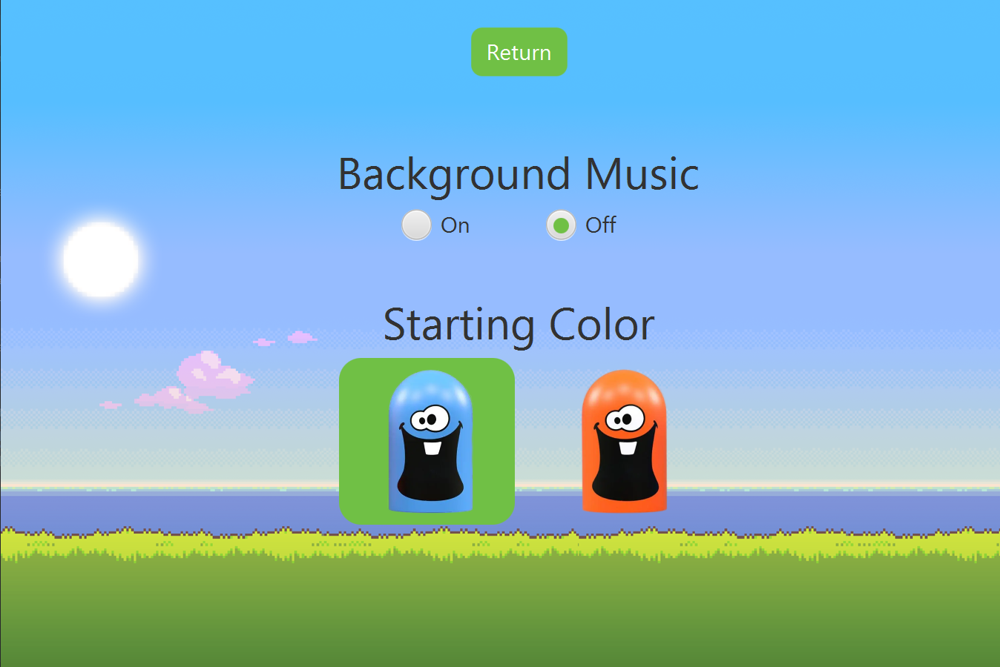
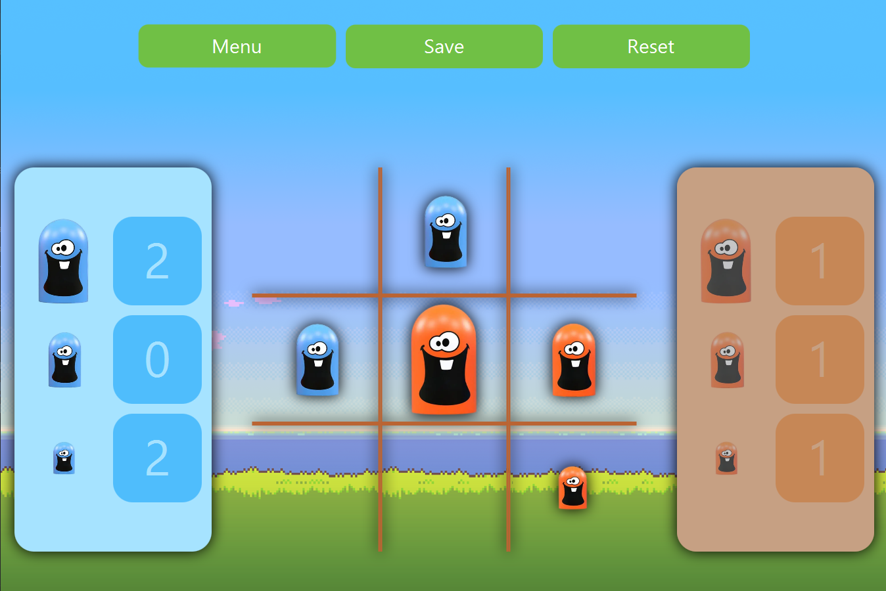

This is a simple Java implementation of the board game Gobblet Gobblers. The interface is built with the GUI library JavaFX.

# 📦 How to run
- Install the [JavaFX SDK](https://openjfx.io/openjfx-docs/) and add it to the project
- Run the `main` function inside the `GobbletGobblersApplication` class
- You can now play the game!

# 🖼️ Example screenshots

